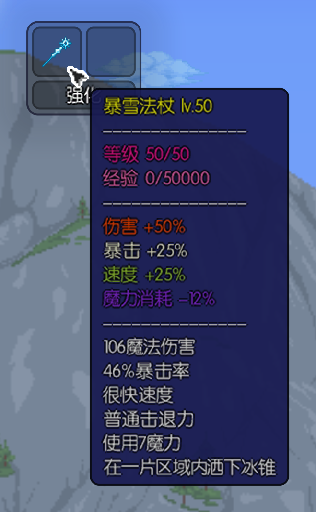

# 预览

    

## 等级系统
1. 使用 `能量晶体` 强化装备
1. 装备基础强化经验为 `1000`，后续每级经验需求都将比上一级提升 `1000`
1. 每级提供属性
    | 属性 | 百分比  |
    |------------|---------|
    | 攻击力 | 0.25% |
    | 暴击 | 0.15% |
    | 使用速度 | 0.15% |
    | 弹幕速度 | 0.15% |
    | 大小 | 0.10%   |
    | 魔力消耗 | 0.15% |
1. 默认等级上限为 `50` 级
1. 使用 `特殊道具(未上线)` 突破等级上限，至高可达 `100` 级

## 星级系统
1. 装备默认星级为 `一星` : ★☆☆☆☆
1. 使用 `特殊道具(未上线)` 提升星级
1. 最高可达 `五星` : ★★★★★
1. 每次提升星级将使由等级提供的 `每级属性` 提升 `25%`
    | 星级 | 百分比  |
    |----------|-------|
    | ★☆☆☆☆ | 0% |
    | ★★☆☆☆ | 25% |
    | ★★★☆☆ | 50% |
    | ★★★★☆ | 75% |
    | ★★★★★ | 100% |
1. 最高可提升由等级提供的 `每级属性` 提升 `100%`